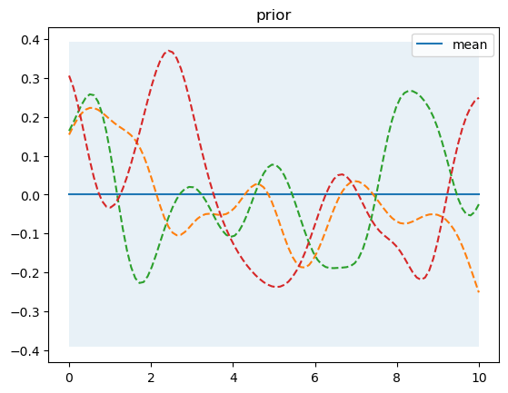
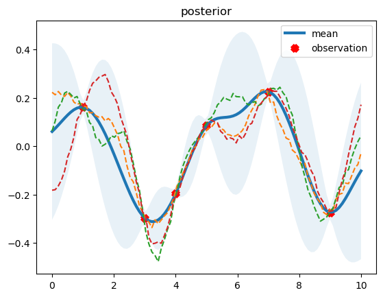

# 高斯过程回归的权空间观点推导

## 1.高斯过程简介

### 1.1定义

高斯过程是随机变量的集合，其中任意有限个随机变量具有联合高斯分布。

在函数空间(function-space view)的观点中，高斯过程可以看作是一个定义在函数上的分布，并且直接在函数空间中进行inference。

与之等价的观点是权空间观点(weight-space view)，在权空间中进行推断,对权向量的不同抽样将产生不同的函数，这与函数空间观点是一致的,但是函数空间的观点更为直接和抽象。

**注** :为方便起见，本文不刻意区分概率密度和概率质量函数，向量用小写字母如$x$表示，矩阵用大写字母如$X$表示，标量将作特别说明。

## 2.部分基础知识（已具备的直接跳至第3节）

### 2.1 部分矩阵计算基础

#### 2.1.1 分块矩阵求逆

感兴趣可看推导过程，否则直接看最后结论。

设矩阵

$$
\begin{pmatrix}
    A&B\\
    C&D
\end{pmatrix}
$$

为可逆矩阵，下面求该矩阵的逆（推导是逆矩阵存在的假设下进行）。

设

$$
\begin{pmatrix}
    A&B\\
    C&D
\end{pmatrix}
\begin{pmatrix}
    X\\
    Y
\end{pmatrix}=\begin{pmatrix}
    P\\
    Q
\end{pmatrix}
$$,

可得
$$
\begin{cases}
    AX+BY=P\dots\dots(1)\\
    CX+DY=Q\dots\dots(2)
\end{cases}
$$
由$(2)$可得，
$$
Y=D^{-1}(Q-CX)\dots\dots(3)
$$
将$(3)$带入(1)并移项整理可得，
$$
X=(A-BD^{-1}C)^{-1}(P-BD^{-1}Q)\dots\dots(4)
$$
将$(4)$带入$(3)$整理可得,
$$
Y=D^{-1}(Q-C(A-BD^{-1}C)^{-1}(P-BD^{-1}Q))
$$
令$M=(A-BD^{-1}C)^{-1}$，其实$M$就是关于$D$的舒尔补(The Shur complements)。

分别令
$$
\begin{cases}
    P=I\\
    Q=\mathbf{}{0}
\end{cases}及
\begin{cases}
    P=\mathbf{}{0}\\
    Q=I
\end{cases}
$$
其中$I$为单位矩阵。
可得原分块矩阵的逆矩阵
$$
\begin{pmatrix}
    M&-MBD^{-1}\\
    -D^{-1}CM&D^{-1}+D^{-1}CMBD^{-1}
\end{pmatrix}\dots\dots(5)
$$
#### 2.1.2 矩阵求逆引理
$$
(A+BCD)^{-1}=A^{-1}-A^{-1}B(I+CDA^{-1}B)^{-1}CDA^{-1}\dots\dots(6)
$$
其中矩阵$A$可逆。
证明：

$设(A+BCD)X=I$，其中$I$为单位矩阵

，则可得
$$
\begin{cases}
    AX+BY=I\dots\dots(7)\\
    Y=BCX\dots\dots(8)
\end{cases}
$$
由$(7)$可得$X=A^{-1}(b-BY)$，并带入$(8)$整理得
$Y=(I+CDA^{-1}B)^{-1}CDA^{-1}$
回代得到
$X=A^{-1}-A^{-1}B(I+CDA^{-1}B)^{-1}CDA^{-1}$

### 2.2 多元高斯分布

#### 2.2.1 联合分布

设 $x$ 是一个 $n$ 维向量,则其概率密度函数是
$$
p(x) = \frac{1}
{(2\pi)^\frac{n}{2}
\begin{vmatrix}
    \Sigma
\end{vmatrix}
^\frac{1}{2}
}
exp{\{
-\frac{1}{2}(x-\mu)^T\Sigma^{-1}(x-\mu)
\}}\dots\dots(9)
$$
其中, $\Sigma$ 和 $\mu$ 分别是随机向量 $x$ 的协方差矩阵和均值向量。

多维高斯分布具有非常良好的性质：

1. 边缘分布满足高斯分布。
2. 条件分布满足高斯分布。
3. 各分量的线性组合也是高斯随机变量。

#### 2.2.2 条件概率分布

设随机向量$x$符合多维高斯分布，将其分为不相交的两部分
$x=\begin{pmatrix}
    x_a\\x_b
\end{pmatrix}$，

$x$的均值向量
$\mu=\begin{pmatrix}
    \mu_a\\\mu_b
\end{pmatrix}$,
协方差矩阵为
$
\Sigma=\begin{pmatrix}
    \Sigma_{aa}&\Sigma_{ab}\\
    \Sigma_{ba}&\Sigma_{bb}
\end{pmatrix}
$，
精度矩阵为
$
\Lambda=\Sigma^{-1}=\begin{pmatrix}
    \Lambda_{aa}&\Lambda_{ab}\\
    \Lambda_{ba}&\Lambda_{bb}
\end{pmatrix}
$。
其中协方差矩阵是正定的，因为其对称性，$\Sigma_{ab}=\Sigma_{ab}^T$，$\Lambda_{ab}=\Lambda_{ab}^T$。

注意这是分块矩阵，不能对每个矩阵块简单求逆，我们使用公式$(5)$，可得
$$
\Lambda_{aa}=(\Sigma_{aa}-\Sigma_{ab}\Sigma_{bb}^{-1}\Sigma_{ba})^{-1}\dots\dots(10)
$$

$$
\Lambda_{ab}=-(\Sigma_{aa}-\Sigma_{ab}\Sigma_{bb}^{-1}\Sigma_{ba})^{-1}\Sigma_{ab}\Sigma_{bb}^{-1}\dots\dots(11)
$$
接下来，我们求在给定$x_b$的条件下，$x_a$的条件概率分布。注意到高斯分布的形式主要取决于指数项，因此我们使用配方法来找出相应的均值和协方差矩阵，而不需要考虑归一化系数，就可以得到条件分布的形式。

指数项为
$$
-\frac{1}{2}(x_a-\mu_a)^T\Lambda_{aa}(x_a-\mu_a)
-\frac{1}{2}(x_a-\mu_a)^T\Lambda_{ab}(x_b-\mu_b)
-\frac{1}{2}(x_b-\mu_a)^T\Lambda_{ba}(x_a-\mu_a)
-\frac{1}{2}(x_b-\mu_b)^T\Lambda_{bb}(x_b-\mu_b)\dots(12)
$$
观察式(9)中指数项的形式，可发现精度矩阵出现在$x$的二次项中，精度矩阵和均值的乘积出现在$x^T$的线性项中，因此我们可得
$$
\Sigma_{a|b}=\Lambda_{aa}^{-1}\dots\dots(13)\\
\Lambda_{ab}\mu_{a|b}=\Lambda_{aa}\mu_a-\Lambda_{ab}(x_b-\mu_b)\dots\dots(13')
$$
由式(10)(11)可得
$$
\mu_{a|b}=(\mu_a-\Lambda_{aa}^{-1}\Lambda_{ab}(x_b-\mu_b))\dots\dots(14)
$$
这样我们就得到了$p(x_a|x_b)$的分布，我们发现它的协方差是不依赖与$x_b$的，而均值是$x_b$的线性函数，这实际上是线性高斯模型的一个例子。

#### 2.2.3 简单的线性高斯模型及贝叶斯定理

贝叶斯公式：
$$
p(x|y)=\frac{p(x)p(y|x)}{p(y)}\dots\dots(15)
$$
我们设
$$
x\sim Gaussian(x|\mu, \Lambda^{-1})\\
y|x\sim Gaussian(y|Ax+b, L^{-1})
$$
其中$\Lambda和L$为$x和y$的精度矩阵，$y$的均值为$x$的线性函数。
接下来，我们想要知道$z=\begin{pmatrix}
    x\\
    y
\end{pmatrix}$的联合分布。

依然使用配方的方法，关注于指数项的系数。根据式(15)可得，
$$
lnp(z)\propto lnp(x)+lnp(y|x)
$$
因此观察
$$
-\frac{1}{2}(x-\mu)^T\Lambda(x-\mu)
-\frac{1}{2}(y-Ax-b)^TL(y-Ax-b)
$$
整理二次项，有
$$
-\frac{1}{2}x^T(\Lambda+A^TLA)x
-\frac{1}{2}y^TLy
+\frac{1}{2}y^TLAx
+\frac{1}{2}x^TA^TLy\\
=-\frac{1}{2}\begin{pmatrix}x^T&y^T\end{pmatrix}
\begin{pmatrix}
    \Lambda+A^TLA&A^TL\\
    LA&L
\end{pmatrix}
\begin{pmatrix}
    x\\
    y
\end{pmatrix}
$$
因此可得精度矩阵
$$
R[z]=\begin{pmatrix}
    \Lambda+A^TLA&A^TL\\
    LA&L
\end{pmatrix}\dots(16)
$$
根据公式(5)可得协方差矩阵，
$$
Cov[z]=\begin{pmatrix}
    \Lambda^{-1}&\Lambda^{-1}A^T\\
    A\Lambda^{-1}&L^{-1}+A\Lambda^{-1}A^T
\end{pmatrix}\dots(17)
$$
再观察一次项
$$
x^T\Lambda\mu-x^TA^TLb+y^TLb=\begin{pmatrix}x\\y\end{pmatrix}^T
\begin{pmatrix}
    \Lambda\mu-A^TLb\\
    Lb
\end{pmatrix}
$$
由此并根据式(13')(16)可得均值
$$
E[z]=\begin{pmatrix}\mu\\A\mu+b\end{pmatrix}\dots\dots(18)
$$
这个结果也是符合我们的直觉的，由此可得$y$的边缘分布为
$$
E[y]=A\mu+b\dots\dots(19)\\
Cov[y]=L^{-1}+A\Lambda^{-1}A^T\dots\dots(20)
$$
## 3.高斯过程回归的权空间观点推导

首先回想一般的线性回归模型，我们先不引入基函数，
$$
y=x^Tw+\epsilon
$$
其中$y,epsilon$是一维变量，代表实际数据值，$\epsilon$表示高斯噪声，我们假设
$$
\epsilon \sim Gaussian(\epsilon|0, \sigma_n^2)
$$
因此，由于训练样本$x$是确定量，则
$$
y|w,x \sim Gaussian(y|x^Tw, \sigma_n^2)
$$
下面规定$Y$为实际数据值组成的向量，$X$为输入$x$组成的矩阵，这里我们反常的规定$X$的每一列为一个输入，样本为
$$
\{(x_i,y_i),i=1,2,\dots n \},其中x_i为N维向量
$$
我们先做出$w$的先验分布假设，设
$$
w \sim Gaussian(w|0, \Sigma_p)\dots\dots(21)
$$
Y的似然函数为
$$
p(Y|w, X)=\prod_{i}^np(y_i|w,x_i)=Gaussian(Y|X^Tw,\sigma_n^2I)\dots\dots(22)
$$
根据贝叶斯定理以及式(19)(20)可得$w$的后验分布
$$
w|Y,X \sim Gaussian(w|\sigma_n^{-2}A^{-1}XY,A^{-1})\\
$$

$$
其中A=\Sigma^{-1}_p+\sigma_n^{-2}XX^T
$$
得到$w$的后验分布之后，我们需要进行预测，即得到预测分布，给定测试样本$(X_*, Y_*)$，我们仍考虑测试样本点带有高斯噪声的情况。从根本上来说，我们最终想得到的不是带有噪声的样本值，而是得到生成这些数据的函数，这也符合定义中所述：高斯过程是一个定义在函数上的分布。假设预测的函数为$f_*$，
则
$$
p(f_*|X_*,X,Y)=\int p(f_*|X_*,w)p(w|X,Y)dw
$$

$$
f_*|X_*,w\sim Gaussian(f_*|X_*^Tw,\sigma_n^2I)
$$
这同样是一个线性高斯模型，我们需要求解边缘概率分布，由式(19)(20)可得
$$
f_*|X_*,X,Y\sim Gaussian(f_*|\sigma_n^{-2}X_*^TA^{-1}XY,X_*^TA^{-1}X_*)
$$
其中
$$
A=\Sigma^{-1}_p+\sigma_n^{-2}XX^T
$$
接下来，我们引入基函数，用基函数$\phi(.)$将样本输入$x_i$映射到高维特征空间，用$\phi(x_i)或\phi_i$来表示映射后的特征向量(feature vector，与eigenvector区分)，用$\Phi$表示特征向量组成的矩阵。
则
$$
f_*|X_*,X,Y\sim Gaussian(f_*|\sigma_n^{-2}\Phi_*^TA^{-1}XY,\Phi_*^TA^{-1}\Phi_*)\dots\dots(23)
$$
其中
$$
A=\Sigma^{-1}_p+\sigma_n^{-2}\Phi\Phi^T\dots\dots(24)
$$
但是显示表示一个合适的基函数(basis function)不是一件容易的事情，更别说加上一个先验的协方差矩阵，因此我们隐式的引入这一式子。

我们设$K=\Phi^T\Sigma_p\Phi$，我们先对式(24)进行处理。
等式两边同时左乘$A^{-1}$，右乘$\Sigma_p\Phi$,进行整理并带入$K$可得
$$
A^{-1}\Phi=\sigma_n^{2}\Sigma_p\Phi(\sigma_n^{2}I+K)^{-1}\dots\dots(25)
$$
将(25)式代入(23)的均值部分可得，
$$
E[f_*]=\Phi_*^T\Sigma_p\Phi(\sigma_n^{2}I+K)^{-1}Y
$$
利用矩阵求逆引理(6)可得$A^{-1}$并带入(23)的协方差部分，可得
$$
Cov[f_*]= \Phi_*^T\Sigma_p\Phi_*-\Phi_*^T\Sigma_p\Phi(\sigma_n^{2}I+K)^{-1}\Phi^T\Sigma_p\Phi_*
$$
最后，我们引入核函数这个概念，设核函数$K(X,X)=\Phi^T\Sigma_p\Phi$,
以此类推，$K(X_*,X)=\Phi_*^T\Sigma_p\Phi$，$K(X_*,X_*)=\Phi_*^T\Sigma_p\Phi_*$
可得最后的形式
$$
E[f_*]=K(X_*,X)(\sigma_n^{2}I+K(X,X))^{-1}Y
$$

$$
Cov[f_*]= K(X_*,X_*)-K(X_*,X)(\sigma_n^{2}I+K(X,X))^{-1}K(X,X_*)
$$
至此，权空间视角的推导过程就结束了。

下面是python实现代码：

$gaussian_process_regression.py$

```python
import numpy as np


class GaussianProcessRegressor:
    """
    kernel: RBF(sigma_overall, l_scale)
    alpha: noise, 1-D array or scaler
    """
    def __init__(self, kernel, sigma_overall, l_scale, alpha=0.):
        self.kernel = kernel(sigma_overall, l_scale)
        self.alpha = alpha

    def fit(self, X, y):
        X = np.asarray(X)
        y = np.asarray(y)
        self.train_x_ = X
        self.train_y_ = y

    def predict(self, X, return_cov=True, return_std=False):
        if return_cov and return_std:
            raise RuntimeError("return_cov, return_std can't be True in the same time")
        if not hasattr(self, 'train_x_'):
            y_mean = np.zeros(X.shape[0])
            if return_cov:
                y_cov = self.kernel(X, X)
                return y_mean, y_cov
            elif return_std:
                y_cov = self.kernel(X, X)
                return y_mean, np.sqrt(np.diag(y_cov))
            else:
                return y_mean
        K = self.kernel(self.train_x_, self.train_x_)
        L = np.linalg.cholesky(K + self.alpha * np.eye(self.train_x_.shape[0]))
        alpha = np.linalg.solve(L, self.train_y_)
        alpha = np.linalg.solve(L.T, alpha)
        y_mean = self.kernel(self.train_x_, X).T @ alpha
        v = np.linalg.solve(L, self.kernel(self.train_x_, X))
        y_cov = self.kernel(X, X) - v.T @ v + self.alpha * np.eye(X.shape[0])
        if return_cov:
            return y_mean, y_cov
        elif return_std:
            return y_mean, np.sqrt(np.diag(y_cov))
        else:
            return y_mean

    def sample_func(self, X, n_samples=1):
        y_mean, y_cov = self.predict(X, return_cov=True, return_std=False)
        sampled_y = np.random.multivariate_normal(y_mean, y_cov, size=n_samples)
        return sampled_y
```

$kernel.py$

```python
import numpy as np


class RBFKernel:
    def __init__(self, sigma, scale):
        self.sigma = sigma
        self.scale = scale

    def __call__(self, x1: np.ndarray, x2: np.ndarray):
        m, n = x1.shape[0], x2.shape[0]
        K_matrix = np.zeros((m, n), dtype=float)
        for i in range(m):
            for j in range(n):
                K_matrix[i, j] = self.sigma * np.exp(-0.5 * np.sum((x1[i] - x2[j]) ** 2) / self.scale)
        return K_matrix

```

测试代码：

```python
from gaussian_process import RBFKernel, GaussianProcessRegressor
import numpy as np
import matplotlib.pyplot as plt


def get_y(x, alpha):
    return np.cos(x)*0.3 + np.random.normal(0, alpha, size=x.shape)

observation_size = 6
gpr = GaussianProcessRegressor(RBFKernel, sigma_overall=0.04, l_scale=0.5, alpha=1e-4)
sample_size = 3

test_x = np.linspace(0, 10, 100)
prior_mean, prior_cov = gpr.predict(test_x, return_cov=True)
sample_ys = gpr.sample_func(test_x, n_samples=sample_size)
uncertainty = 1.96 * np.sqrt(np.diag(prior_cov))

plt.plot(test_x, prior_mean, label='mean')
plt.fill_between(test_x, prior_mean-uncertainty, prior_mean+uncertainty, alpha=0.1)
for i in range(sample_size):
    plt.plot(test_x, sample_ys[i], linestyle='--')
plt.legend()
plt.title('prior')
plt.show()  # 至此绘制先验分布

train_x = np.array([3, 1, 4, 5, 7, 9])
train_y = get_y(train_x, alpha=1e-4)

gpr.fit(train_x, train_y)
y_mean, y_cov = gpr.predict(test_x, return_cov=True)
sample_ys = gpr.sample_func(test_x, n_samples=sample_size)
uncertainty = 1.96 * np.sqrt(np.diag(y_cov))

plt.plot(test_x, y_mean, label='mean', linewidth=3)
plt.fill_between(test_x, y_mean-uncertainty, y_mean+uncertainty, alpha=0.1)
for i in range(sample_size):
    plt.plot(test_x, sample_ys[i], linestyle='--')
plt.scatter(train_x, train_y, c='red', marker='x', label='observation', linewidths=5)
plt.legend()
plt.title('posterior')
plt.show()  # 绘制后验分布

```

运行效果如下





下次补充函数空间的观点。

## 参考文献
[1]C. E. Rasmussen & C. K. I. Williams.(2006). *Gaussian Processes for Machine Learning*.7-29.

[2]Christopher M. Bishop.(2007). *Pattern Recognition and
Machine Learning*. 78-93.
