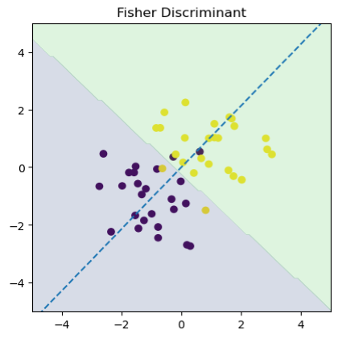
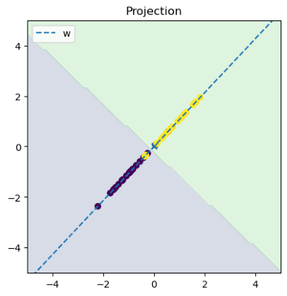
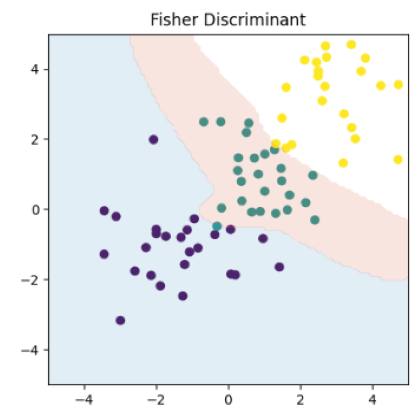

# Fisher线性判别分析

降维作为一种减少特征冗余的方法，也可以应用在线性分类当中。在K分类问题中，Fisher线性判别分析通过最大化类间方差和最小化类内方差，将数据映射到K-1维空间进行分类。本文将着重讨论推导多分类的情况。

## 1. 符号标识

|  符号   | 意义   |
|  ----  | ----   | 
|  $N_k$|属于第K类的样本数量|
|  $N$|样本总数|
|  $K$|类别总数|
| $\bold{x}\in \R^{D}$  | D维样本向量 |  
| $\bold{X}\in \R^{N\times D}$  | 样本矩阵 | 
|  $\bold{S}_{W}\in \R^{D \times D}$|类内散度矩阵| 
|  $\bold{S}_{B}\in \R^{D \times D}$|类间散度矩阵|
|  $\bold{W}\in \R^{D \times K-1}$|投影矩阵|
| $\bold{y}\in \R^{K-1}$  | 投影后样本向量 |
| $\bold{u}\in \R^{K-1}$  | 投影后样本均值 |    
|  $\bold{P}_{W}\in \R^{K-1 \times K-1}$|投影后类内散度矩阵| 
|  $\bold{P}_{B}\in \R^{K-1 \times K-1}$|投影后类间散度矩阵|
|  $Tr(·)$|矩阵的迹|


## 2. 散度矩阵(Scatter Matrices)

定义类内散度矩阵
$$
    \bold{S}_{W} = \sum_{k=1}^{K}\bold{\Sigma}_k  \cdots\cdots (2.1)
$$

$$
    \bold{\Sigma}_k = \sum_{n \in C_k}(\bold{x}_n-\bold{m}_k)(\bold{x}_n-\bold{m}_k)^T \cdots\cdots (2.2)
$$
其中
$$
\bold{m}_k= \frac{1}{N_k}\sum_{n \in C_k}\bold{x}_n \cdots\cdots (2.3)
$$

定义类间散度矩阵
$$
    \bold{S}_B = \sum_{k=1}^{K}N_k(\bold{m}_k-\bold{m})(\bold{m}_k-\bold{m})^T \cdots\cdots (2.4)
$$

其中
$$
\bold{m}_k = \frac{1}{N}\sum_{n=1}^N\bold{x}_n = \frac{1}{N}\sum_{k=1}^{K}N_k\bold{m}_k \cdots\cdots (2.5)
$$

可得混合散度矩阵(the mixture scatter matrix)

$$
    \bold{S}_M = \bold{S}_{W} + \bold{S}_{B}    \cdots\cdots (2.6)
$$

## 3. 二分类求解

$$
      设均值向量\bold{m}_1=\frac{1}{N_1}\sum_{n\in C_1}\bold{x}_n, \bold{m}_2=\frac{1}{N_2}\sum_{n\in C_2}\bold{x}_n, 投影方向为\bold{w},y_n=\bold{w}^T\bold{x}_n.
$$

   $投影后均值为u_1=\bold{w}^T\bold{m}_1, u_2=\bold{w}^T\bold{m}_2, 类间距离(u_1-u_2)^2$.

$$
   类内总方差s_1^{2}=\sum_{n\in C_1}(y_n-u_1)^2,s_2^{2}=\sum_{n\in C_2}(y_n-u_2)^2.最大化类间距离，最小化类内方差。
$$

$$
      J = \frac{(u_1-u_2)^2}{s_1+s_2}=\frac{\bold{w}^T\bold{S}_B\bold{w}}{\bold{w}^T\bold{S}_W\bold{w}}
$$
   其中,
$$
      \bold{S}_B=(\bold{m}_1-\bold{m}_2)(\bold{m}_1-\bold{m}_2)^T,\bold{W}_W=\sum_{n\in C_1}(\bold{x}_n-\bold{m}_1)(\bold{x}_n-\bold{m}_1)^T + \sum_{n\in C_2}(\bold{x}_n-\bold{m}_2)(\bold{x}_n-\bold{m}_2)^T
$$

$J$对$\bold{w}$求导可得

$$
      \frac{\partial J}{\partial \bold{w}}=\frac{2(\bold{S}_B\bold{w}\bold{w}^T\bold{S}_W\bold{w}-\bold{w}^T\bold{S}_B\bold{w}\bold{S}_W\bold{w})}{(\bold{w}^T\bold{S}_W\bold{w})^2}=0
$$

$$
      \bold{S}_W\bold{w} \propto \bold{S}_B\bold{w}=(\bold{m}_1-\bold{m}_2)(\bold{m}_1-\bold{m}_2)^T\bold{w} \propto (\bold{m}_1-\bold{m}_2)
$$

$$
      \rightarrow \bold{w} \propto \bold{S}_w^{-1}(\bold{m}_1-\bold{m}_2),我们只关注投影的方向,也可以给其范数加上约束。
$$

## 4. 多分类求解

由于我们有$K$个类别，根据贝叶斯分类器对此类问题的处理，是得到$K$个后验概率$p_1(\bold{x})...p_K(\bold{x})$, 然而我们知道$\sum_i p_i=1$，因此，只有$K-1$个是线性无关的。**那么我们讲$D$维样本空间映射到$K-1$维空间是没有分类信息的损失的**。

于是，有线性映射

$$
    \bold{y} = \bold{W}^T\bold{x}   \cdots\cdots (4.1)
$$

$$
    \bold{P}_{W} = \bold{W}^T\bold{P}_{W}\bold{W}\cdots\cdots (4.2)
$$

$$
    \bold{P}_{B} = \bold{W}^T\bold{P}_{W}\bold{W}\cdots\cdots (4.3)
$$

在二分类时的思想是最大化类间方差，最小化类内方差，于是可得二分类时的损失函数

$$
    J(\bold{W}) = \frac{\bold{w}^T\bold{S}_{B}\bold{w}}{\bold{w}^T\bold{S}_{W}\bold{w}}
$$

与之不同的是，多分类情况下分子分母都是矩阵而不是标量，且矩阵没有除法，因此需要采用另一种判别准则。

判别准则有多种，我们这里使用其中一种。可以先从直觉上理解，具体是为什么等我明白了再补充吧。

$$
    J(\bold{W}) = Tr(\bold{P}_{W}^{-1}\bold{P}_{B}) = Tr((\bold{W}^T\bold{S}_{W}\bold{W})^{-1}\bold{W}^T\bold{S}_{B}\bold{W}) \cdots\cdots (4.4)
$$

对其求微分可得
$$
\begin{align}
d(J) &= Tr[d(\bold{W}^T\bold{S}_{W}\bold{W})^{-1})\bold{W}^T\bold{S}_{B}\bold{W})] + Tr[2(\bold{W}^T\bold{S}_{W}\bold{W})^{-1}\bold{W}^T\bold{S}_Bd(\bold{W})]  \\
&= Tr[-(\bold{W}^T\bold{S}_{W}\bold{W})^{-1}) d(\bold{W}^T\bold{S}_{W}\bold{W}) (\bold{W}^T\bold{S}_{W}\bold{W})^{-1}\bold{W}^T\bold{S}_{B}\bold{W}] + Tr[2(\bold{W}^T\bold{S}_{W}\bold{W})^{-1}\bold{W}^T\bold{S}_Bd(\bold{W})]    \\
&= Tr[-2\bold{P}_{W}^{-1}\bold{W}^T\bold{S}_W d(W) \bold{P}_{W}^{-1} \bold{P}_{B}] + Tr[2\bold{P}_W^{-1} \bold{W}^T\bold{S}_B d(\bold{W})]\\
&= Tr[(-2 \bold{P}_W^{-1} \bold{P}_B \bold{P}_W^{-1} \bold{W}^T \bold{S}_W + 2\bold{P}_W^{-1} \bold{W}^T\bold{S}_B) d(\bold{W})]
\end{align}  \tag{4.5}
$$

可得
$$
    \frac{\partial J}{\partial \bold{W}} = -2 \bold{S}_W \bold{W} \bold{P}_W^{-1} \bold{P}_B \bold{P}_W^{-1}   + 2\bold{S}_B \bold{W} \bold{P}_W^{-1} = 0   \cdots\cdots(4.6)
$$

$$
    \bold{S}_W^{-1} \bold{S}_B \bold{W} = \bold{W} \bold{P}_W^{-1} \bold{P}_B  \cdots\cdots(4.7)
$$

式4.7的形式容易与矩阵的特征值联系起来。式中的散度矩阵$\bold{S}_B$是不满秩的，它是由$K$个秩为1的矩阵相加得到的，而在式2.3的约束下，只有$K-1$个矩阵是线性无关的，因此它的秩最多为$K-1$。而$\bold{S}_W$是满秩的，则$\bold{S}_W^{-1} \bold{S}_B$只有$K-1$个非零特征值。

命题1：存在一个线性变换$Q\in \R^{K-1 \times K-1}且Q^{-1}存在$，使得
$$
    \bold{Q}^T \bold{P}_W \bold{Q} = \bold{I}, 
    \bold{Q}^T \bold{P}_B \bold{Q} = \bold{\Lambda} \cdots\cdots (4.8) \\
    其中，\bold{I}为K-1阶单位矩阵，\bold{\Lambda}为K-1阶对角矩阵。
$$

证明：
$$
    \because \bold{P}_W正定，存在C使得\bold{C}^T \bold{P}_W \bold{C} = I,
    而 \bold{C}^T \bold{P}_B \bold{C}是实对称矩阵，从而存在正交变换\\
    \bold{D}^T (\bold{C}^T \bold{P}_B \bold{C}) \bold{D}=diag(\lambda_1, \dots, \lambda_{K-1}) \\
    令 \bold{Q} = \bold{C}\bold{D},则\bold{Q}^T \bold{P}_W \bold{Q} = \bold{D}^T (\bold{C}^T \bold{P}_W \bold{C}) \bold{D} = \bold{D}^T \bold{D} = \bold{I}, 
    得证。
$$

将式4.8带入式4.7可得
$$
    \bold{S}_W^{-1} \bold{S}_B (\bold{W} \bold{Q}) = (\bold{W} \bold{Q}) \bold{\Lambda} \cdots\cdots (4.9)
$$

可以发现，**$\bold{\Lambda}$不仅是$\bold{P}_B$的特征值矩阵，还是$\bold{S}_W^{-1} \bold{S}_B$的特征值矩阵**。则有，
$$
    J(\bold{W}) = Tr(\bold{P}_W^{-1} \bold{P}_B) = \sum_i^{K-1}\lambda_i \\
    Tr(\bold{S}_W^{-1} \bold{S}_B) = \sum_i^{D}\mu_i \cdots\cdots(4.10)
$$

注意，这里$\bold{S}_W^{-1} \bold{S}_B$是我们可以通过观测到的样本计算出来的，所以特征值是确定的$\mu_i, i=1,...,D$,式4.10给出了与目标函数之间的关系，并且由正交变换的不变性，我们可得知$\bold{W}$就是由$\bold{S}_W^{-1} \bold{S}_B$最大的$K-1$个特征值对应的特征向量构成的。

## 代码实现





```python
# 二分类
class FisherLinearDiscriminant:
    """
    Only for 2 classes
    """
    def __init__(self, w=None, threshold=None):
        self.w = w
        self.threshold = threshold

    def fit(self, x_train: np.ndarray, y_train: np.ndarray):
        x0 = x_train[y_train == 0]
        x1 = x_train[y_train == 1]
        u1 = np.mean(x0, axis=0)
        u2 = np.mean(x1, axis=0)
        cov = np.cov(x0, rowvar=False) + np.cov(x1, rowvar=False)
        w = np.linalg.inv(cov) @ (u2 - u1)
        self.w = w / np.linalg.norm(w)
        g0 = Gaussian()
        g0.fit(x0 @ self.w)
        g1 = Gaussian()
        g1.fit(x1 @ self.w)
        x = np.roots([g1.var - g0.var,
                      2*(g1.mean*g0.var - g0.mean*g1.var),
                      g1.var * g0.mean ** 2 - g0.var * g1.mean ** 2
                      - g1.var * g0.var * np.log(g1.var / g0.var)
                      ])
        if g0.mean < x[0] < g1.mean or g1.mean < x[0] < g0.mean:
            self.threshold = x[0]
        else:
            self.threshold = x[1]

    def project(self, x: np.ndarray):
        return x @ self.w

    def classify(self, x: np.ndarray):
        return (x @ self.w > self.threshold).astype(int)


class MultiFisherLinearDiscriminant:
    """
    For K >= 2
    """
    def __init__(self, W=None, threshold=None, n_classes=3, peaks: Iterable = None):
        self.W = W
        self.threshold = threshold
        self.n_classes = n_classes
        self.peaks = peaks or [2] * n_classes
        assert len(self.peaks) == self.n_classes, "peaks shape error"

    def fit(self, x_train: np.ndarray, y_train: np.ndarray):
        cov_b = []  # between
        cov_w = []  # within
        mean = []
        mu = x_train.mean(0, keepdims=True)  # 1 D
        for k in range(self.n_classes):
            x_k = x_train[y_train == k]  # N_k D
            mean_k = np.mean(x_k, axis=0, keepdims=True)  # 1 D
            mean.append(mean_k)
            dist = x_k - mean_k  # N_K D
            cov_k = dist.T @ dist
            cov_w.append(cov_k)
            dist = mean_k - mu
            cov_k = (y_train == k).sum() * dist.T @ dist
            cov_b.append(cov_k)
        self.mean = np.concatenate(mean, axis=0)
        cov_b = np.sum(cov_b, 0)  # D D
        cov_w = np.sum(cov_w, 0)
        A = np.linalg.inv(cov_w) @ cov_b
        _, vectors = np.linalg.eig(A)
        self.W = vectors[:, -(self.n_classes - 1):]  # D, K-1
        x_prj = x_train @ self.W
        self.__getDistributions(x_prj, y_train)

    def __getDistributions(self, x_train, y_train):
        distributions = []
        for k in range(self.n_classes):
            x_k = x_train[y_train == k]  # N_k D
            gmm = GaussianMixture(classes=self.peaks[k]) if self.peaks[k] > 1 else Gaussian()
            gmm.fit(x_k)
            distributions.append(gmm)
        self.distributions = distributions

    def project(self, x: np.ndarray):
        assert x.ndim <= 2, "ndim should be less than 3"
        if x.ndim == 1:
            x = x[None, :]
        return x @ self.W  # N, K-1

    def classify(self, x: np.ndarray):
        assert x.ndim <= 2, "ndim should be less than 3"
        probs = []
        if x.ndim == 1:
            x = x[None, :]
        x = self.project(x)
        for i in range(x.shape[0]):
            probs.append(np.concatenate([gmm._pdf(x[i]) for gmm in self.distributions]))
        classes = np.argmax(probs, axis=-1)
        return classes
```

```python
#测试
def create_data(size=50, add_outlier=False, add_class=False):
    assert size % 2 == 0
    x0 = np.random.normal(size=size).reshape(-1, 2) - 1
    x1 = np.random.normal(size=size).reshape(-1, 2) + 1
    if add_outlier:
        x = np.random.normal(size=10).reshape(-1, 2) + np.array([5, 10])
        return np.concatenate([x0, x1, x]), np.concatenate([np.zeros(size//2), np.ones(size//2 + 5)])
    if add_class:
        x = np.random.normal(size=size).reshape(-1, 2) + 3
        return np.concatenate([x0, x1, x]), np.concatenate([np.zeros(size//2), np.ones(size//2), 2*np.ones(size//2)])
    return np.concatenate([x0, x1]), np.concatenate([np.zeros(size//2), np.ones(size//2)])

model = FisherLinearDiscriminant()
model.fit(x_train, y_train)

plt.scatter(x_train[:, 0], x_train[:, 1], c=y_train)
x1_test, x2_test = np.meshgrid(np.linspace(-5, 5, 100), np.linspace(-5, 5, 100))
x_test = np.concatenate([x1_test, x2_test]).reshape(2, -1).T
y_pred = model.classify(x_test)
x = np.linspace(-5, 5, 20)
plt.contourf(x1_test, x2_test, y_pred.reshape(100, -1), alpha=0.2, levels=np.linspace(0,1,3))
plt.plot(x, x * model.w[1]/model.w[0], label='w', linestyle='--')
plt.title('Fisher Discriminant')
plt.gca().set_aspect('equal', adjustable='box')
plt.xlim(-5, 5)
plt.ylim(-5, 5)
plt.show()

plt.plot(x, x * model.w[1]/model.w[0], label='w', linestyle='--')
w = model.w
rollmat = np.zeros((2,2))
div = np.sqrt(w[0] ** 2 + w[1] ** 2)
rollmat[0,0] = w[0]/div
rollmat[0,1] = w[1]/div
rollmat[1,0] = -w[1]/div
rollmat[1,1] = w[0]/div
x_proj = x_train@w
x_proj = np.concatenate([x_proj[:,None], np.zeros_like(x_proj[:,None])],axis=-1).reshape(-1, 2)
#plt.scatter(x_proj[:,0], x_proj[:,1]-5, c=y_train)
x_roll = x_proj @ rollmat
plt.contourf(x1_test, x2_test, y_pred.reshape(100, -1), alpha=0.2, levels=np.linspace(0,1,3))
plt.scatter(x_roll[:, 0], x_roll[:,1], c=y_train)
plt.scatter(0, 0, marker='x', alpha=1)
plt.title('Projection')
plt.gca().set_aspect('equal', adjustable='box')
plt.xlim(-5, 5)
plt.ylim(-5, 5)
plt.legend()
plt.show()
```


## 后记
有些地方还没整明白，明白了再回来补充.

## 参考文献
[1] Fukunaga, K. (1990). Introduction to Statistical Pattern Recognition (Second ed.). Academic Press. 441-454.
[2] Christopher M. Bishop.(2007). Pattern Recognition and Machine Learning. 187-192.